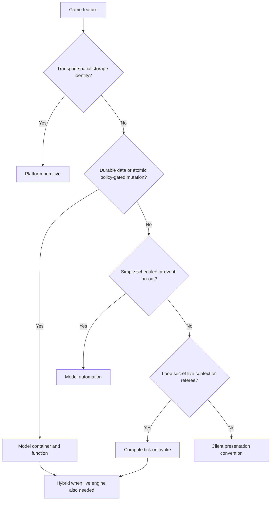
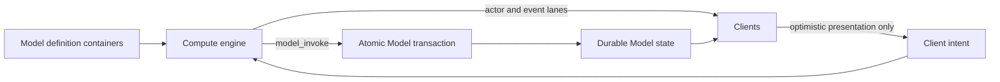

# Choosing Game APIs

Crowded Kingdoms has five complementary implementation tiers. Most
production features use more than one:

1. **Platform primitives** move identity, permissions and realtime data.
2. **Model containers/functions** hold durable truth and atomic rules.
3. **Model automations** schedule or fan out simple Model functions.
4. **Compute modules** run bounded loops, secrets, simulation and referees.
5. **Client conventions** render, interpolate and provide optimistic UX.

The default is **Model first**. Add compute at an expression ceiling. Use a
platform primitive when the problem is transport, spatial storage or
identity rather than a game rule. Never make a client authoritative for a
competitive result.

## Decision flow

Ask these in order:

| Question | Choose |
|---|---|
| Is this actor/voxel/grid/session/team/channel transport or storage? | Platform primitive |
| Must it survive restarts, be queryable, policy-gated or commit atomically? | Model |
| Is it a simple timer/event selector calling a loop-free function? | Automation |
| Does it need loops, graph search, hidden state, server RNG or live poses? | Compute |
| Is it interpolation, animation, local prediction or UI state only? | Client |

## The five tiers

### Platform primitives

Use platform primitives for **where and how** data moves:

| Need | Surface |
|---|---|
| Presence and poses | Actors + UDP/world sessions |
| Building/world cells | Chunks, voxels and voxel state |
| Spatial ownership | Grids + permissions |
| Match membership/turn holder | Sessions |
| Parties, guild chat, match notifications | Teams + channels |
| Cosmetics/save blobs | Avatars + user/app state |
| Legacy low-stakes coordinator | Elected host |

Host election is useful for targeted delivery and low-stakes co-op
coordination. It is **not** an anti-cheat boundary. Competitive simulation
belongs in compute.

### Model functions

Use the Model API for durable catalogs/config, owner-indexed state, atomic
inventory/economy transactions, permission effects, and notifications.
Examples: stacks, recipes, wallets, quest progress, plots, score records.

Prefer one intent-level function (`craft`, `trade`, `claim_reward`) over a
client composing several mutations. A denial must leave every referenced
container unchanged.

### Model automations

Automations are the seconds/minutes-scale server tier:

- shop/NPC restock;
- daily quest/season reset;
- coarse permission/guard sweep;
- event-triggered progress increment;
- timestamp maintenance.

Do not use an automation for pathfinding, projectiles, many-agent motion,
hidden information or sub-second decisions.

### Compute ticks and invokes

Use compute for:

- A*, flow fields, behavior trees and many-entity loops;
- smooth shared NPC/mob/world simulation (normally 1–5 Hz);
- hidden deck order, pity counters and server RNG;
- combat/movement/action referees using live server-known poses;
- projectiles/AoE, capture progress, shrinking zones and race timing;
- server-computed ranking over large/competitive boards.

Ticks simulate; invokes referee a caller's intent. Compute state is a
rebuildable cache (256 KiB); durable state remains in Model/platform
storage. A trusted engine commits Model transactions with `model_invoke`
instead of reproducing transaction logic through sequential property writes.

### Client conventions

Clients own presentation: rendering, interpolation, animation, input,
prediction and rollback. Optimism must reconcile to a Model/compute result
or authoritative event. Client RNG, peer-supplied damage, client-sorted
tournament standings and elected-host competitive referees are
anti-patterns.

#### Named pattern: self-reported vitals

Survival stats that only hurt their own reporter — hunger drain, breath,
fall damage, self-heal after eating — may be committed by client-called
Model functions (`owner_of_self` policy) instead of a compute referee.
Blocks with Friends' `PlayerStats` functions (`consume_hunger`,
`damage_player`, `heal_player`, `eat_food`) are the reference. This is a
deliberate client-trust choice: a hostile client can at most flatter its own
vitals. Use it knowingly, with these guardrails:

1. **Clamp every write in the expression** (`min(20, self.health + $amount)`)
   so no call can exceed caps regardless of params.
2. **Gate restorative calls on consumed resources** — `eat_food` composes
   `owner_of_self` with a condition that a food stack was consumed; the
   consumption itself is an atomic Model transaction.
3. **Never let self-reported state gate a grant or a competitive result.**
   Kill credit, loot, XP from combat, and PvP damage go through the compute
   referee (`is_automation`-locked functions); vitals may influence
   *presentation*, not rewards.
4. The expression language has no clock builtin, so **true cooldowns cannot
   be expressed in an invoke policy**. If abuse of a self-reported function
   would matter (PvP healing mid-fight), move that write behind a compute
   referee invoke — the referee has `now_ms()` and live poses — rather than
   approximating a rate limit in Model.

## Four simulation cadences

| Tier | Typical cadence | Good for |
|---|---:|---|
| Replication/client render | 20–60 Hz | input, interpolation, visual prediction |
| Compute engine | 1–5 Hz | authoritative agents, referees, world systems |
| Automation | seconds–minutes | restock, dailies, coarse selectors |
| Model invoke | on demand | atomic player/admin transactions |

A model-only deployment may expose a documented low-stakes host fallback.
When an engine is required for competitive integrity, capability detection
must fail closed rather than silently downgrade authority.

## Recommended hybrid pattern

Examples: `MobDef` + mob-engine, `MatchMeta` + match-engine,
`AbilityDef` + abilities-engine, `ControlPoint` + territory. Model data is
designer-editable; compute owns live decisions; clients consume lanes.

## Mechanic → API map

### World and agents

| Feature | Recommended stack | Kit/engine/example |
|---|---|---|
| Building | voxels + grids; compute only for server edits/referee | BWF |
| Claims/plots/doors/locks | Model + grid permission effects | `kit.plots`, `kit.objects` |
| World generation | deterministic client/platform, or compute for authoritative generation | custom |
| Resource nodes/farming | Model timestamps for simple growth; world-engine for spatial loops | `kit.worldsim`, world-engine |
| Weather/time | Model defs + world-engine transitions | world-engine |
| Instances/dungeons | sessions/grids + Model run record + compute | instance-engine, dungeon-run |
| Territory/control points | Model defs/ownership + compute capture | territory |
| NPCs/pets | Model defs + npc-engine actor lane | npc-engine |
| Hostile mobs | Model pools/defs + mob-engine/referee | mob-engine, BWF |
| Pathfinding/BT/turn AI | compute library inside an engine | `kit-ai`, TMS |
| Directors/waves | Model encounter defs + compute | director, tower-defense |

### Conflict and sessions

| Feature | Recommended stack | Kit/engine/example |
|---|---|---|
| HP/status | Model durable HP + compute referee/ticks | `kit.combat` |
| Melee/ranged hit | compute invoke using live poses; Model commit | combat referee |
| Abilities/projectiles/AoE | Model AbilityDef + compute | abilities-engine, arena-blitz |
| Movement anti-cheat | actor lane + compute observe/flag | movement-warden |
| Score/win conditions | Model result + match-engine authority | `kit.matches` |
| Turns/lobbies | sessions + Model MatchMeta + match-engine | match-engine |
| Hidden cards/decks | Model public zones + module-held secrets | deck-engine, card-duel |
| Matchmaking | compute queues → compute-event handoff → match | matchmaking |
| Racing/ghosts | actor poses + compute timing + board-engine | racing |
| Ball possession | compute authority + actor lane | possession |
| Minigames | invoke-only compute when secrets/referee matter | minigame scaffold |

### Economy, progression and platform

| Feature | Recommended stack | Kit/engine/example |
|---|---|---|
| Inventory/stack transfer | atomic Model functions | `kit.inventory` |
| Crafting/barter | generated atomic Model transaction; optional compute proximity/referee | inventory/economy kits |
| Wallets/shops/escrow | Model | `kit.economy` |
| Order-book market | Model wallets + compute matching | market-engine |
| Loot | Model weighted roll for small tables; compute pity/secret roll for large tables | `kit.loot` |
| XP/achievements/quests/FTUE | Model | progression + quests |
| Idle production | elapsed-time compute catch-up + Model result | idle-factory |
| Leaderboards | Model small board; board-engine for competitive ranking | board-engine |
| Liveops/battle pass | Model season/windows + progression/features; scheduler only for world modifiers | `kit.liveops` |
| Moderation/telemetry | Model/client | moderation + telemetry |
| Presence/chat/parties | platform actors/teams/channels | `kit.social` |

## Genre starter bundles

| Genre | Start with |
|---|---|
| MMO/survival | inventory, plots, quests, world + npc/mob/combat engines |
| Social/cozy | plots, social, economy, quests; automations for restock/dailies |
| RPG/roguelike | progression, inventory, quests, combat, instances, director, loot |
| Tactics | sessions + Model units + match/tactics compute referee |
| Card game | matches + deck-engine |
| Arcade/FPS-lite | abilities + movement-warden + combat/match referee |
| Party/minigame | matches + minigame + board-engine |
| Tower defense/MOBA-lite | director + mobs + flow fields + abilities/territory |
| BR-lite | instances + shrinking zones + director + movement warden |
| Racing/sports | racing + possession + board-engine |

## Cost and operations

Model functions bill through GraphQL/model usage. Compute bills
`wasm_compute_units` plus egress. One unit is approximately one reference
CPU millisecond:

`GREATEST(CEIL(cpu_us/1000), CEIL(fuel/22,000,000))`.

Reference measurements: ~1.4 ms/db-op, 0.4 ms/radius scan and 0.5 ms/spatial
emit. Batch reads, amortize scans and emit only changed state. Compute is
bounded by fuel, watchdog, memory, host-call, egress, circuit and spend-cap
gates; disable module → app → environment in that order.

## Deployment choices

1. Parameterize a platform engine with Model definition containers
   (preferred): `computeDeployTemplate` or `kit.deploy({ engines: [...] })`.
2. Fork a template when the rule genuinely differs.
3. Write a custom module only when no catalog engine fits.

Next: [Model API](/game-api/game-models) ·
[Automations](/game-api/autonomous-processes) ·
[Compute Modules](/game-api/compute-modules) ·
[Compute Engines](/game-api/compute-engines) ·
[Grids & permissions](/game-api/grids-and-permissions)
