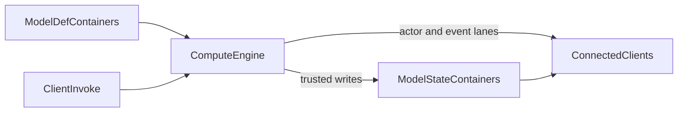

# Model API vs Compute — choosing the right server logic

Crowded Kingdoms has two complementary server-logic tiers:

- **Game Model API** — durable containers, atomic expression functions,
  authority policies, notifications, and declarative automations.
- **Compute Modules** — sandboxed Rust/WASM for loops, simulation,
  pathfinding, secrets, and referee decisions.

The default is **Model first**. Add compute where you hit an expression
ceiling; do not move logic to WASM for fashion.

## Decision table

| Requirement | Use |
|---|---|
| Atomic inventory/economy transaction | Model function |
| Durable catalog/config/state | Model container |
| Daily reset, shop restock, coarse periodic sweep | Model automation |
| Permission/ownership gate on a mutation | Model invoke policy |
| Notify clients that durable state changed | Model notification |
| Per-frame-ish simulation (1–5 Hz) | Compute tick |
| A*, flow fields, behavior trees, many-agent loops | Compute |
| Hidden cards, server RNG, anti-cheat referee | Compute invoke |
| Projectiles/AoE, control-point capture, shrinking zones | Compute |
| Server-computed sort/rank/percentiles | Compute |
| Realtime pose consumption / actor-lane egress | Compute + existing wire |

## Expression-ceiling symptoms

Reach for compute when one or more are true:

1. The rule needs an unbounded/budgeted loop, graph search, or many-entity
   scan.
2. Fidelity below an automation's practical cadence matters.
3. A secret must never replicate (deck order, pity counters, house pick).
4. A competitive decision must use live server-known context (range,
   cooldown, caller pose) rather than client claims.
5. Multiple clients need smooth shared motion emitted from one authority.
6. Client-side sorting/host election has become correctness-critical.

Stay on the model when the work is a small atomic transaction or a simple
timestamp-derived state. A crop whose stage is `(now - planted_at) / period`
does not need a ticking module.

## The hybrid pattern (recommended for games)

Most engine-backed layers are **hybrid**:

- Model containers are durable truth and designer-editable data.
- Module state is a rebuildable cache (bounded to 256 KB).
- Players call module invokes for competitive actions.
- The engine writes durable results through trusted paths.
- Clients consume the existing actor/server-event lanes.

Examples: `MobDef` + mob-engine, `MatchMeta` + match-engine,
`AbilityDef` + abilities-engine, `ControlPoint` + territory.

## Cost model

Model functions bill through GraphQL/model usage. Compute bills per minute:

- `wasm_compute_units` — approximately one reference CPU millisecond,
  calculated as the larger of measured CPU time and deterministic fuel
  equivalent: `GREATEST(CEIL(cpu_us/1000), CEIL(fuel/22,000,000))`.
- `wasm_egress_msgs` / `wasm_egress_bytes` — module-emitted replication.

Phase 10 measurements found host calls dominate real engines: roughly
1.4 ms per db-op, 0.4 ms per radius scan, and 0.5 ms per spatial emit on the
single-box reference builder. Batch reads (`container_get_batch`), amortize
scans, and emit only changed state.

## Deployment choices

1. **Parameterize a platform engine** (preferred): seed its definition
   containers, then deploy by name with `computeDeployTemplate` or
   `kit.deploy(blueprints, { engines: [...] })`.
2. **Fork a template** when your game rule genuinely differs: scaffold it
   with `crowdy-compute new --engine ...`, keep kit-crate logic reusable,
   then deploy your source.
3. **Custom module** for a game-specific loop with no catalog engine.

Both SDKs expose `engineAvailable()` on engine-backed kits, so model-only
deployments retain their blueprint behavior.

## Operations boundary

Compute is bounded by fuel, watchdog, memory, host-call, egress, circuit,
and spend-cap gates. A failing module cannot escape its worker; repeated
failures open its circuit. Use the management Compute tab or diagnostics
queries to inspect it, and disable the narrowest scope first (module, app,
then environment).

Next:

- [Compute tutorial](/game-api/compute-tutorial)
- [Compute Modules](/game-api/compute-modules)
- [Compute Engines](/game-api/compute-engines)
- [Compute host API](/game-api/compute-host-api)
